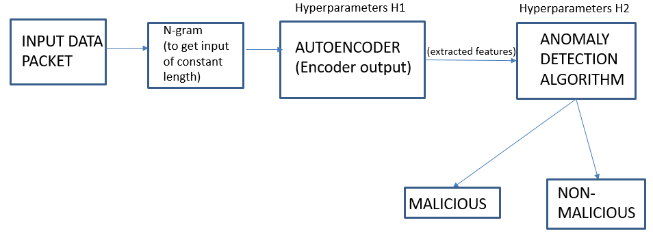

# DataExfiltrationDetection | PyTorch

This is a Machine Learning framework to detect Data Exfiltration; specifically DNS exfiltration. 
We will be using the [Data Exfiltration Toolkit](https://github.com/sensepost/DET) framework to generate synthetic data to test out our algorithm. Specifically, we will be using it to generate a mixture of "Normal" traffic and "Malicious" traffic. This ML framework is aimed at doing a packet wise classification of Normal/Malicious. The overall pipeline of the algorithm is illustrated below: 

Firstly, we have to create 2 Virtual Machines; one to simulate an Attacker and the other to simulate the Server.  The script [det.py](./data_generating_codes/det.py) has to ben run on both attacker and server side in the corresponding modes. On the server side, the script [script.datagen.py](./data_generating_codes/script_datagen.py) has to be run which internally calls [det.py](./data_generating_codes/det.py). This script can be used to generate DNS packets which are both malicious and normal. Malicious data is created by exfiltrating out the images/files in the folder
