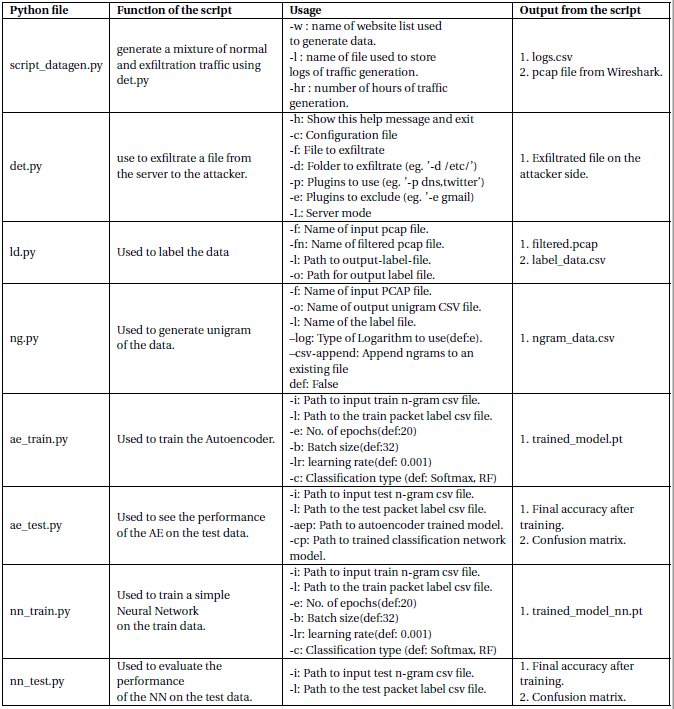

# Data Exfiltration Detection | PyTorch

This is a Machine Learning framework to detect Data Exfiltration; specifically DNS exfiltration. 
We will be using the [Data Exfiltration Toolkit](https://github.com/sensepost/DET) framework to generate synthetic data to test out our algorithm. Specifically, we will be using it to generate a mixture of "Normal" traffic and "Malicious" traffic. This ML framework is aimed at doing a packet wise classification of Normal/Malicious. The overall pipeline of the algorithm is illustrated below: 

# Generate and label Data
Firstly, we have to create 2 Virtual Machines; one to simulate an Attacker and the other to simulate the Server.  The script [det.py](./data_generating_codes/det.py) has to ben run on both attacker and server side in the corresponding modes. On the server side, the script [script.datagen.py](./data_generating_codes/script_datagen.py) has to be run which internally calls [det.py](./data_generating_codes/det.py). This script can be used to generate DNS packets which are both malicious and normal. Malicious data is created by exfiltrating out the images/files in this [folder](./data_generating_codes/ExfiltrationData). 
It should be noted that when each file in that folder is exfiltrated, multiple packets are created as the file gets broken down into multiple pieces. 
We will be using Wireshark to capture the network traffic. 
Now, in order to perform supervised learning, we need to have some notion of ground truth / labels to make sure the algorithm learns what we want. The [ld.py](./ld.py) is used to label the .pcap data captured, packetwise. 

# Extract features / reduce to constant length

In order to feed the data (each packet) into a neural network, we have to reduce to a constant length form. N-grams help us achieve this. The file [ng.py](./ng.py) calculates the unigram representation of each packet in the data. 

# Feed to neural netwrk

We have 3 NN frameworks; 2 fully connected and 1 recurrent framework. The 2 FCN frameworks are Autoencoders+Classification nets and just a Classification network. The recurrent framework uses LSTMs. The figure below summarizes all the scripts and their functions  
